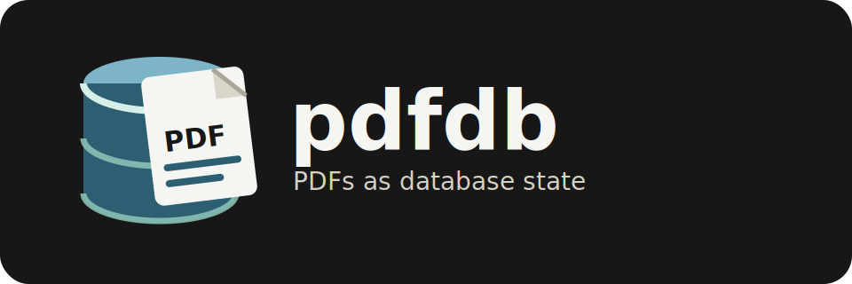

# pdfdb

Database-backed PDF reader workspace. Postgres stores PDF bytes as content-addressed chunks. Zathura reads immutable local cache files that are reconstructed from the database, and the web UI reads through the range-capable Go API.

`PDF DB.app` is the pocket desktop controller: a fixed portrait macOS app that stores database profiles in Keychain, warms the local PDF cache, lists/searches PDFs, imports URLs or files, opens PDFs in Zathura, highlights open Zathura documents, and closes matching Zathura windows.

## Prerequisites

- Go 1.26+
- Bun
- Neon CLI authenticated on `$PATH`
- Zathura
- Wails v2 for building the desktop app

## Install

```sh
go install github.com/lmist/pdfdb/cmd/pdfdb@latest
go install github.com/wailsapp/wails/v2/cmd/wails@latest
```

## Quick Start

```sh
pdfdb init-db
pdfdb seed
pdfdb list
pdfdb verify
pdfdb profile save default
pdfdb serve
```

`pdfdb profile save default` reads the current `DATABASE_URL` and stores it in macOS Keychain. The desktop app and CLI can use that active profile without printing or embedding database credentials.

Build and launch the desktop controller:

```sh
cd desktop
wails doctor
wails build
open "build/bin/PDF DB.app"
```

From there, use the app instead of the CLI for normal reading: search the database, double-click a PDF to open it in Zathura, use the green open indicators to see active Zathura documents, close them from the row button, and import new PDFs from either a URL or a local file.

In another shell:

```sh
cd web
bun install
bun run dev
```

For Zathura:

```sh
pdfdb open-all
```

Zathura receives normal read-only PDF files from `~/Library/Caches/pdfdb/documents`. The database remains the source of truth; the local files are disposable cache material for fast desktop opening.

Use Zathura's normal bindings to move through them: `J`/`K` for next/previous page, `gg`/`G` for first/last page, `Tab` for index mode, and `:open <path>` for another cached PDF.

No custom Zathura plugin is needed for this path: Zathura's PDF plugin handles the cached `application/pdf` files directly. A custom plugin becomes useful only if pdfdb should teach Zathura a new URI or MIME type such as `pdfdb://document/<id>` instead of normal file paths. Zathura plugin development starts with `ZATHURA_PLUGIN_REGISTER` and a shared-object plugin that registers supported MIME types: https://pwmt.org/projects/zathura/plugins/development/

## Commands

```text
pdfdb init-db                      create or update the Neon/Postgres schema
pdfdb ingest <url-or-path> [...]   import PDFs into chunked database storage
pdfdb seed                         ingest the three DBOS seed PDFs
pdfdb list                         list documents with ids, slugs, sizes, and page counts
pdfdb verify                       reconstruct all PDFs from chunks and verify SHA-256
pdfdb serve [host:port]            run the HTTP API with PDF range support
pdfdb open <id-or-slug|all>        open cached PDF(s) in Zathura
pdfdb open-all                     open every cached PDF in Zathura
pdfdb zathura [id-or-slug|all]     start /Applications/Zathura.app from DB cache
pdfdb zathura-pick                 choose a database PDF and open it in Zathura
pdfdb profile list                 list Keychain-backed database profiles
pdfdb profile save [name]          save DATABASE_URL as the active Keychain profile
pdfdb profile use <name>           switch the active database profile
pdfdb profile delete <name>        remove a database profile
```

For a database-backed picker inside Zathura, add this to `~/.config/zathura/zathurarc`:

```text
map <C-o> exec /Users/lou/go/bin/pdfdb zathura-pick
```

Adjust the binary path if `go env GOPATH` is not `/Users/lou/go`. That gives Zathura a database-connected open action: press `Ctrl-o`, pick from the pdfdb library, and the selected PDF opens in the desktop Zathura app. A true Zathura plugin is a renderer plugin for a MIME type, not a general UI sidebar extension; the installed API exposes document/page/index/render hooks, not a global file-tree panel.
